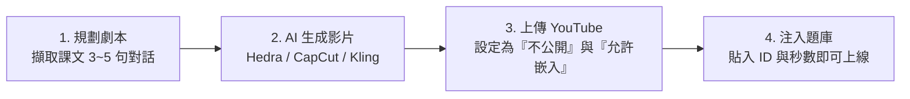

# 山豬影城 (Cinema) 與 雙語聽說探險館 (Language Lab) 未來研發與 AI 影片工作流指南

本指南詳細規劃「山豬影城」全片放映機制、「雙語聽說探險館」微秒級截取題目測驗，以及教師如何利用「免費 AI 影片生成平台」自製教科書微電影並注入系統之完整 SOP。

---

## 1. 核心組件與資料結構

### 1.1 核心程式碼位置
* **題庫資料集**：`src/data/unitVideoQuestionData.js`
* **YouTube 播放容器**：`src/components/common/YouTubeClipPlayer.jsx`
* **聽說館主控台**：`src/features/langlab/LanguageLabHub.jsx`
* **小鎮山豬影城**：`src/games/town/CinemaTheaterModal.jsx`

### 1.2 題庫資料格式範例 (`unitVideoQuestionData.js`)
```javascript
export const UNIT_VIDEO_LIBRARY = [
  {
    id: 'demo_hwg_g3',
    title: 'Here We Go 第 1 冊：Hello! What’s Your Name?',
    book: 1,
    unit: 'Unit 1',
    description: '初學美語必備：親切自我介紹、打招呼與問候姓名。',
    youtubeId: 'zMdq9jSaNLg', // YouTube 11 碼影片 ID
    totalDuration: 100,
    clips: [
      {
        id: 'c1_1',
        start: 5,               // 起始播放秒數
        end: 17,                // 結束暫停秒數
        promptZh: '看影片中親切打招呼，選出反覆詢問的問候句：',
        targetEn: 'Hello, hello, what’s your name?',
        targetZh: '哈囉，哈囉，你叫什麼名字？',
        speaker: 'Noodle & Friends',
        choices: [
          { key: 'A', text: 'Hello, hello, what’s your name?', isCorrect: true },
          { key: 'B', text: 'How old are you today?', isCorrect: false },
          { key: 'C', text: 'Goodbye, see you tomorrow!', isCorrect: false }
        ]
      }
    ]
  }
];
```

---

## 2. 零流量負擔 (Zero Bandwidth Cost) 串流原理

1. **無主機流量成本**：
   - 影片檔案與 CDN 串流全部由 YouTube (Google) 免費承載。
   - 採用 `https://www.youtube-nocookie.com/embed/{youtubeId}` 防追蹤安全網域。
   - 無論全校數百位學生同時觀看幾千次，都不會耗損 Cloudflare 或伺服器的頻寬額度。
2. **音訊防干擾機制**：
   - 在 `YouTubeClipPlayer.jsx` 與 `CinemaTheaterModal.jsx` 載入時，自動觸發 `soundEngine.pauseSceneBgm()` 暫停小鎮或教室背景音樂；關閉或離開時自動 `resumeSceneBgm()` 恢復播放。

---

## 3. 免費 AI 影片生成四大平台評估與實作工作流

| 平台名稱 | 適用情境 | 免費方案特點 | 推薦度 |
| :--- | :--- | :--- | :--- |
| **Hedra (Character 2.0)**<br>`hedra.com` | **課本人物對嘴說話**<br>(Talking Head) | 每日提供免費生成額度。<br>上傳角色插圖 + 英文文字/語音，自動生成口型同步影片。 | ⭐⭐⭐⭐⭐<br>(首選推薦) |
| **CapCut 電腦版 / 剪映**<br>`capcut.com` | **整課對話腳本一鍵成片**<br>(Script to Video) | 核心功能完全免費。<br>貼上課文對話，自動配真人美語、自動找畫面素材、自動上字幕。 | ⭐⭐⭐⭐⭐<br>(最高效率) |
| **可靈 AI (Kling AI)**<br>`klingai.com` | **電影級逼真場景與動作**<br>(Text/Image to Video) | 每日登入送 66 靈感值，每天免費產出多支 1080p 5 秒流暢鏡頭。 | ⭐⭐⭐⭐ |
| **Pika (Pika 2.0)**<br>`pika.art` | **3D 卡通、動物說話** | 每日定時免費補充電力，適合繪本風格。 | ⭐⭐⭐⭐ |

---

## 4. 教師製作 AI 影片至平台發布的「標準四步 SOP」



### 第一步：規劃課本對話腳本 (Scripting)
從 `src/data/hereWeGoTextbookData.js` 中選定單元重點句，例如第 2 冊 Unit 1（顏色與動物）：
- Line 1: `Look at the bird. What color is it?`
- Line 2: `It's blue. It's a blue bird.`
- Line 3: `Do you like birds? Yes, I do.`

### 第二步：生成影片 (Generation)
- **使用 Hedra**：上傳課本角色（如 Amber 或 貓頭鷹），輸入 Line 1 ~ Line 3，生成角色說話短片。
- **使用 CapCut**：利用「文字成片」功能，輸入對白，套用 Cartoon/Education 模板，1 分鐘導出 MP4。

### 第三步：上傳至 YouTube (Upload as Unlisted)
1. 進入學校 Google 帳號的 YouTube Studio。
2. 點擊「建立」➔「上傳影片」。
3. **瀏覽權限（Visibility）選擇「不公開 (Unlisted)」**：
   - 僅擁有連結或嵌入網站（本校系統）才能觀看。
   - 不會出現在搜尋結果或推薦頁面，保護隱私。
4. **確認「允許嵌入 (Allow embedding)」勾選**（預設開啟）。
5. 複製網址中的 11 碼影片 ID（例如 `https://www.youtube.com/watch?v=AbCd1234XYZ` 中的 `AbCd1234XYZ`）。

### 第四步：在系統中上線使用
1. **即時測試法（免寫程式）**：
   - 打開雙語聽說探險館 ➔ 切換至「影片微電影聽力」 ➔ 點右上角「⚙️ 自訂測試」 ➔ 貼上 ID、起訖秒數與正確句子 ➔ 點擊「立即載入測驗」即可現場合成出題！
2. **正式收錄進山豬影城與題庫庫存**：
   - 在新視窗中將 YouTube 網址發給 AI，AI 便會寫入 `src/data/unitVideoQuestionData.js`，執行 `npm run build` 並部署至 Cloudflare Pages，永久提供全校學生使用！
